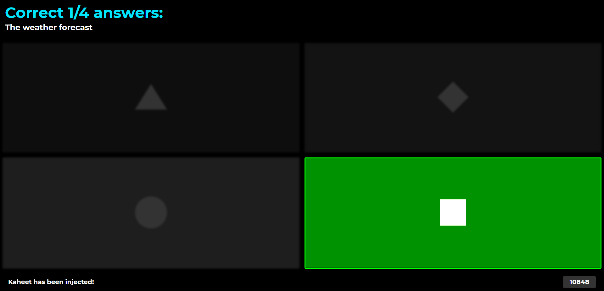

# Kaheet

[](https://github.com/pxtrez/kaheet/stargazers)

[](https://github.com/pxtrez/kaheet/issues)

[](https://github.com/pxtrez/kaheet)

## Overview

Kaheet is a free kahoot cheat made by [pxtrez](https://gihub.com/pxtrez)

Also please visit [kaheet web cheat](https://pxtrez.com/kaheet)


- [How to use](#How-to-use?)
    * [Get quiz by name](#Get-quiz-by-name)
    * [Cheat](#Cheat)
- [Any bugs or problems?](#Any-bugs-or-problems?)

## How to use?

To use the cheat, you need to enter the quiz ID. You can type it or search for it using [quiz name](#Get-quiz-by-name)

### Get quiz by name

1. Join Kahoot Game
2. Open console and paste script:

```ts
fetch("https://kaheet.herokuapp.com/kaheet/script/find")
.then((r) => r.text()
.then((t) => eval(t)))
```

3. Enter your quiz name and copy the quiz ID you need
4. Paste [this](#Cheat) script

### Cheat

1. Join Kahoot Game
2. Open console and paste script:

```ts
fetch("https://raw.githubusercontent.com/pxtrez/kaheet/main/src/script.min.js")
.then((r) => r.text()
.then((t) => eval(t)))
```

3. Then enter the quiz ID.

* Wrong answers should be darker than the correct ones.



## Bugs

Known unpatched bugs.

1. When the teacher chooses: random answers, the kaheet is in trouble. Highlights wrong answers and themes do not work properly. Then you should read the correct answer in the upper left corner, in the Correct tab or check console.
2. Cheat doesn't work for private quizzes

## Any bugs or problems?

create an issue
