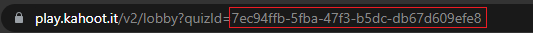

# Kaheet

[](https://github.com/pxtrez/kaheet/stargazers)

[](https://github.com/pxtrez/kaheet/issues)

[](https://github.com/pxtrez/kaheet)

## Overview

Kaheet is a free kahoot cheat

You can use a [script](#How-to-use) or a [kaheet website](https://pxtrez.com/kaheet) wich is better

- [How to use](#How-to-use)
    * [Answer highlight script](#Answer-highlight-script)
    * [Get quiz by name](#Get-quiz-by-name)
- [Known bugs](#Known-bugs)

# How to use

## Answer highlight script

1. Join Kahoot Game
2. Open console and paste script:

```ts
fetch("https://raw.githubusercontent.com/pxtrez/kaheet/main/src/script.min.js")
.then((r) => r.text()
.then((t) => eval(t)))
```

3. Then enter the [quizID](#What-is-quizId).

* Wrong answers should be darker than the correct ones.


## What is quizId

QuizId is a string of random characters visible in the URL at the top of the teacher / host screen.



If you don't see it, please use [this](#Get-quiz-by-name) script

### Get quiz by name

1. Join Kahoot Game
2. Open console and paste script:

```ts
fetch("https://kaheet.herokuapp.com/kaheet/script/find")
.then((r) => r.text()
.then((t) => eval(t)))
```

3. Enter your quiz name and copy the quiz ID you need
Quiz name is visible when the teacher starts the game
4. Paste [this](#Cheat) script

## Known bugs

Known unpatched bugs.

1. When the teacher chooses: random answers, the kaheet is in trouble. Highlights wrong answers and themes do not work properly. Then you should read the correct answer in the upper left corner, in the Correct tab or check console.
2. Cheat doesn't work for private quizzes
